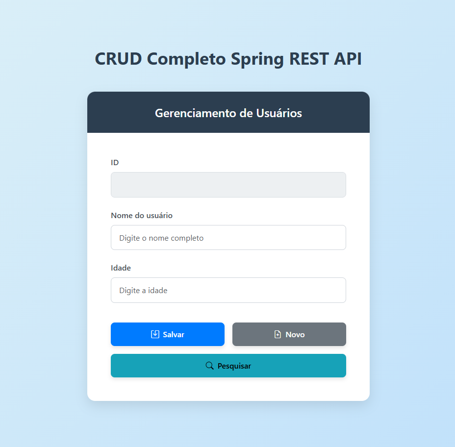

# CRUD Completo Spring Boot: API REST Full-Stack com Java 22


## 📌 Visão Geral

Este não é apenas um projeto CRUD básico. É uma demonstração **full-stack** completa que implementa uma API REST robusta e moderna usando **Spring Boot 3.3** e **Java 22**. O projeto demonstra o domínio de ponta a ponta do desenvolvimento web, desde a persistência de dados com JPA até um front-end dinâmico e responsivo que consome a API.

O objetivo é apresentar uma arquitetura limpa e funcional, pronta para produção, que sirva como um modelo para aplicações web complexas.

## ✨ Funcionalidades Principais

* **🚀 API RESTful Completa:** Implementação de todos os métodos HTTP (`GET`, `POST`, `PUT`, `DELETE`) para um gerenciamento de usuários completo.
* **🧩 Persistência de Dados Avançada:** Uso de Spring Data JPA para uma interação fluida com o banco de dados, incluindo uma **query JPQL customizada** para buscas otimizadas por nome.
* **🎨 Front-end Interativo:** Uma interface de usuário (UI) construída com **Bootstrap 5** e **jQuery**, que consome a API de forma assíncrona (AJAX).
* **🧱 Arquitetura em Camadas:** Clara separação de responsabilidades entre `Controller` (camada de API), `Repository` (camada de dados) e `Model` (entidade).
* **✅ Validação e Respostas HTTP:** Uso correto de `ResponseEntity` para retornar códigos de status HTTP apropriados (ex: `201 CREATED`, `200 OK`).
* **⚙️ Gerenciamento de Dependências:** Projeto configurado com Maven, incluindo `spring-boot-devtools` para um desenvolvimento ágil.

## 🛠️ Tecnologias Utilizadas

Este projeto utiliza um stack moderno e altamente requisitado no mercado:

### Back-end
* **Java 22:** A versão LTS mais recente, garantindo performance e segurança.
* **Spring Boot 3.3:** Para criação rápida de aplicações robustas e auto-configuráveis.
* **Spring Data JPA (Hibernate):** Para persistência de dados e mapeamento objeto-relacional (ORM).
* **Spring Web:** Para a criação dos endpoints da API REST.

### Front-end
* **HTML 5:** Estrutura semântica da página.
* **Bootstrap 5:** Para um design responsivo e moderno (componentes de UI, modais, etc.).
* **jQuery & AJAX:** Para realizar chamadas assíncronas à API, proporcionando uma experiência de usuário fluida sem recarregar a página.

### Banco de Dados & Ferramentas
* **PostgreSQL:** Um dos bancos de dados relacionais open-source mais poderosos.
* **Maven:** Para gerenciamento de dependências e build do projeto.

---

## 🏛️ Arquitetura da API

A API foi desenhada seguindo os princípios REST e uma arquitetura em camadas:

1.  **`Usuario.java` (Model):** A entidade JPA que mapeia a tabela `usuario` no banco de dados.
2.  **`UsuarioRepository.java` (Repository):** A interface que estende `JpaRepository`, responsável pela abstração do acesso aos dados. Inclui o método customizado `buscarPorNome(String name)`.
3.  **`GreetingsController.java` (Controller):** O cérebro da aplicação. Expõe os endpoints REST, recebe as requisições HTTP, processa a lógica de negócio e retorna as `ResponseEntity` adequadas.

### 📜 Endpoints da API

| Método | Endpoint | Parâmetros | Descrição |
| :--- | :--- | :--- | :--- |
| `GET` | `/listatodos` | - | Lista todos os usuários cadastrados. |
| `POST` | `/salvar` | `RequestBody Usuario` | Salva um novo usuário no banco. |
| `PUT` | `/atualizar` | `RequestBody Usuario` | Atualiza um usuário existente (requer ID). |
| `DELETE` | `/deletar` | `RequestParam usuarioId` | Deleta um usuário pelo seu ID. |
| `GET` | `/buscaruserid` | `RequestParam userId` | Busca um usuário único pelo seu ID. |
| `GET` | `/buscarpornome` | `RequestParam name` | Busca uma lista de usuários por nome (case-insensitive). |

---

## 🚀 Como Executar o Projeto

Para rodar este projeto localmente, siga os passos abaixo:

1.  **Clone o repositório:**
    ```bash
    git clone [https://github.com/seu-usuario/crud-completo-spring.git](https://github.com/seu-usuario/crud-completo-spring.git)
    cd crud-completo-spring
    ```

2.  **Configure o Banco de Dados (PostgreSQL):**
    * Crie um banco de dados local chamado `spring-boot-crud`.
    * *Opcional: Se desejar usar outro nome ou credenciais, atualize o arquivo `application.properties`.*

3.  **Configure as Credenciais:**
    * Abra o arquivo `src/main/resources/application.properties`.
    * Altere `spring.datasource.username` e `spring.datasource.password` para as suas credenciais do PostgreSQL.

    ```properties
    # Exemplo de configuração
    spring.datasource.url=jdbc:postgresql://localhost:5432/spring-boot-crud
    spring.datasource.username=postgres
    spring.datasource.password=sua_senha
    spring.jpa.hibernate.ddl-auto=update
    ```

4.  **Execute a Aplicação:**
    * Você pode rodar o projeto diretamente pela sua IDE (Eclipse/IntelliJ) localizando e executando a classe `CrudCompletoSpringApplication.java`.
    * Ou, execute via Maven no terminal:
    ```bash
    mvn spring-boot:run
    ```

5.  **Acesse a Aplicação:**
    * Abra seu navegador e acesse o front-end em:
    * `http://localhost:8080/crud-completo-spring/`

## 📸 Screenshots da Aplicação

**Adicione aqui imagens de:**
1.  O formulário principal de cadastro.
2.  O modal de pesquisa com os resultados na tabela.
3.  O modal de edição preenchido.
4.  O modal de confirmação de deleção.

**Exemplo:**


---

## 👨‍💻 Autor

Projeto desenvolvido como um portfólio de habilidades em desenvolvimento Full-Stack Java.

Feito com ❤️ por **Caio Filardis**.

[](https://www.linkedin.com/in/caiofilardis/)  [](https://github.com/CaioFilardis)

----